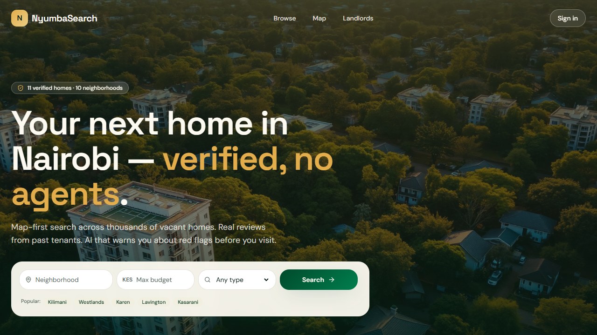
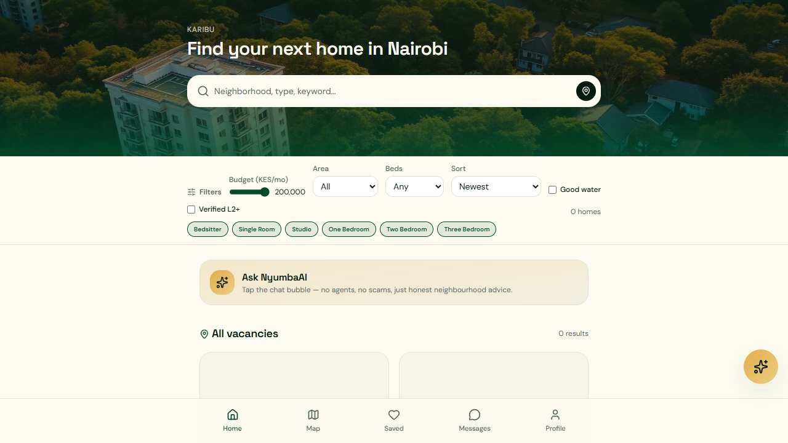
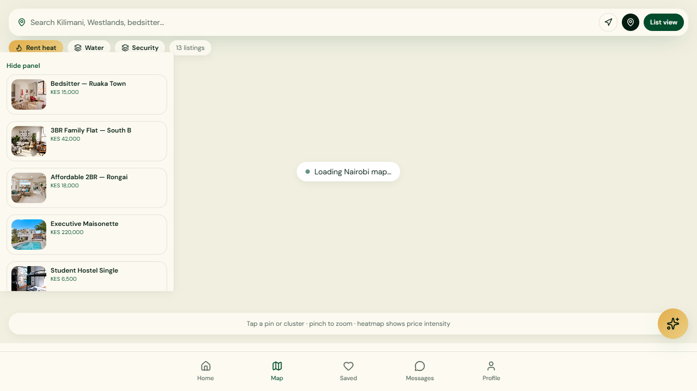
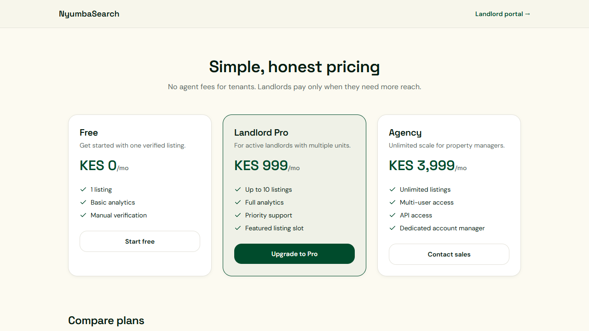
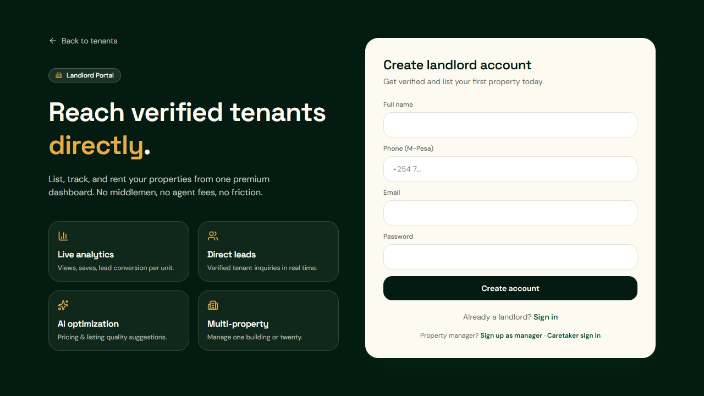
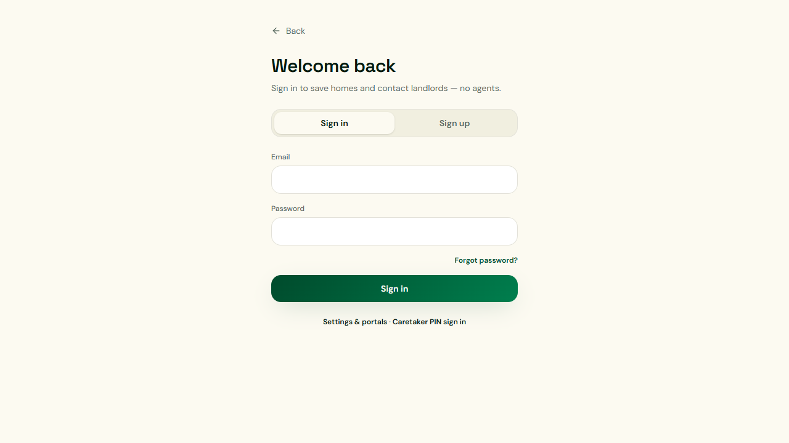

<div align="center">

# NyumbaSearch


**Kenya's rental property search platform** — verified listings, neighbourhood intelligence, and landlord tools built for Nairobi and beyond.

[](https://nyumbasearch.com)
[](https://github.com/da-homi3/find-nyumba-smart/actions/workflows/ci-deploy.yml)
[](https://nodejs.org)
[](https://react.dev)
[](https://www.typescriptlang.org)
[](https://tanstack.com/start)
[](https://workers.cloudflare.com)
[](https://supabase.com)
[](LICENSE)

[Production](https://nyumbasearch.com) · [Repository](https://github.com/da-homi3/find-nyumba-smart) · [Monorepo](https://github.com/da-homi3/nyumbani)

<br />



_Map-first search across verified homes — no agents, no scams._

</div>

---

## Screenshots

### Tenant experience

|                                    Landing                                    |                                   Search & filters                                   |                               Map view                                |
| :---------------------------------------------------------------------------: | :----------------------------------------------------------------------------------: | :-------------------------------------------------------------------: |
|  |  |  |
|                  Hero search with neighbourhood intelligence                  |                        Budget, beds, property type & NyumbaAI                        |                 Clustered pins, heatmap & side panel                  |

### Landlord & pricing

|                              Pricing plans                               |                                  Landlord portal                                  |                                   Sign in                                    |
| :----------------------------------------------------------------------: | :-------------------------------------------------------------------------------: | :--------------------------------------------------------------------------: |
|  |  |  |
|                      Free, Pro & Agency tiers (KES)                      |                        Direct tenant reach, analytics & AI                        |                       Save homes and contact landlords                       |

> **Regenerate screenshots** after UI changes: `npm run demo:capture`  
> Output: `demos/screenshots/*.png` and `demos/nyumbasearch-walkthrough.html`

---

## Overview

NyumbaSearch helps renters find verified vacant homes without agent fees or scams. Landlords, agencies, and property managers list directly, verify in stages, and message tenants in-platform. The product is tailored for the Kenyan market: M-Pesa and card payments, WhatsApp-style messaging, county-aware service directories, and neighbourhood signals (water, security, internet, commute) on every listing.

---

## Features

### Tenant experience

- **Search & browse** — filter by price, bedrooms, property type, and neighbourhood
- **Map view** — Mapbox-powered map with clustered pins and side-panel previews
- **Property detail** — photos, amenities, neighbourhood scores, and in-app messaging
- **Saved listings & compare** — shortlist and compare properties side by side
- **Viewing requests** — book viewings without leaving the platform

### Landlord & agency portals

- **Listing wizard** — create and publish properties with media uploads
- **Lead inbox** — respond to tenant enquiries in real time
- **Analytics** — views, saves, and conversion metrics per listing
- **Boost & promote** — paid visibility for high-intent listings
- **Team management** — invite agents and caretakers with role-based access

### Service provider directory

- **21 categories** — electricians, plumbers, movers, cleaning, solar, roofing, and more
- **141+ verified providers** — seeded directory with county coverage across 14 counties
- **County filter** — narrow providers by Nairobi, Mombasa, Kisumu, Nakuru, and others

### Payments & billing

- **M-Pesa (Daraja)** — STK push for subscriptions and boosts
- **Pesapal** — card checkout for landlords and advertisers
- **Stripe** — international card support where configured

### Platform & admin

- **Multi-role auth** — tenant, landlord, agency, manager, caretaker, admin
- **Verification pipeline** — staged document checks for landlords and listings
- **Revenue dashboard** — admin view of M-Pesa, card, and subscription revenue
- **WhatsApp listing bot** — optional WhatsApp Business API integration
- **AI assistant** — Gemini-powered property descriptions and search help

---

## Tech stack

| Layer         | Technology                                                     |
| ------------- | -------------------------------------------------------------- |
| Framework     | [TanStack Start](https://tanstack.com/start) + React 19        |
| Routing       | TanStack Router (file-based routes)                            |
| Data fetching | TanStack Query                                                 |
| Styling       | Tailwind CSS 4, Radix UI, Framer Motion                        |
| Database      | [Supabase](https://supabase.com) (Postgres + Auth + RLS)       |
| Hosting       | [Cloudflare Workers](https://workers.cloudflare.com) via Nitro |
| Maps          | Mapbox GL (Google Maps fallback)                               |
| Email         | SendGrid                                                       |
| Payments      | M-Pesa Daraja, Pesapal, Stripe                                 |
| AI            | Google Gemini                                                  |
| Testing       | Vitest, Playwright, custom smoke/e2e scripts                   |
| CI/CD         | GitHub Actions → Cloudflare Workers                            |

---

## Prerequisites

- **Node.js 22+** (matches CI; Node 20 may work locally but is not guaranteed)
- **npm** 10+
- A **Supabase** project with the schema applied (see [Database setup](#database-setup))
- **Cloudflare** account for production deploy (Wrangler CLI)
- Optional: Mapbox token, SendGrid API key, M-Pesa/Pesapal sandbox credentials

---

## Quick start

```bash
# From the monorepo root
git clone --recurse-submodules https://github.com/da-homi3/nyumbani.git
cd nyumbani/find-nyumba-smart

npm install
cp .env.example .env
# Edit .env with your Supabase keys and optional integrations

npm run check:env   # verify required vars are set
npm run dev         # http://localhost:5173
```

The dev server hot-reloads on file changes. API routes and SSR run through the TanStack Start + Nitro dev server.

---

## Environment variables

Copy `.env.example` to `.env` and fill in values. **Never commit `.env` with real secrets.**

### Required

| Variable                        | Description                                                           |
| ------------------------------- | --------------------------------------------------------------------- |
| `SUPABASE_URL`                  | Supabase project URL                                                  |
| `SUPABASE_PUBLISHABLE_KEY`      | Supabase anon/public key                                              |
| `SUPABASE_SERVICE_ROLE_KEY`     | Service role key — **server/Worker only**, never expose to the client |
| `VITE_SUPABASE_URL`             | Same as `SUPABASE_URL` (client bundle)                                |
| `VITE_SUPABASE_PUBLISHABLE_KEY` | Same as `SUPABASE_PUBLISHABLE_KEY` (client bundle)                    |

### App URLs

| Variable                     | Description                                         |
| ---------------------------- | --------------------------------------------------- |
| `PUBLIC_APP_URL`             | Canonical app URL (e.g. `https://nyumbasearch.com`) |
| `SITE_URL` / `VITE_SITE_URL` | Used for sitemap, emails, and OAuth redirects       |

### Integrations (optional for local dev)

| Group           | Key variables                                                                                  |
| --------------- | ---------------------------------------------------------------------------------------------- |
| Maps            | `VITE_MAPBOX_TOKEN`, `VITE_GOOGLE_MAPS_API_KEY`                                                |
| Email           | `SENDGRID_API_KEY`, `SENDGRID_FROM_EMAIL`                                                      |
| M-Pesa          | `MPESA_ENV`, `MPESA_SHORTCODE`, `MPESA_CONSUMER_KEY`, `MPESA_CONSUMER_SECRET`, `MPESA_PASSKEY` |
| Pesapal         | `PESAPAL_ENV`, `PESAPAL_CONSUMER_KEY`, `PESAPAL_CONSUMER_SECRET`                               |
| AI              | `GEMINI_API_KEY`, `GEMINI_MODEL`                                                               |
| WhatsApp        | `WHATSAPP_TOKEN`, `WHATSAPP_VERIFY_TOKEN`, `WHATSAPP_PHONE_ID`                                 |
| Cron / internal | `CRON_SECRET`, `CARETAKER_SESSION_SECRET`                                                      |
| Feature flags   | `NYUMBA_USE_MOCK_LISTINGS`, `ALLOW_DEMO_PAYMENTS`, `FCM_SEND_ENABLED`                          |

See [`.env.example`](.env.example) for the full list with inline comments.

---

## Database setup

Schema lives in `supabase/migrations/` (43 migration files). Apply them to your Supabase project using one of:

```bash
# Supabase CLI (recommended)
supabase db push

# Or run the bundled migration scripts
npm run migrate:local        # bash
npm run migrate:local:ps1      # PowerShell on Windows
```

### Targeted migrations

Individual migration helpers are available for incremental updates:

```bash
npm run db:migrate:service-providers   # provider directory tables
npm run db:migrate:provider-counties   # county coverage for providers
npm run db:migrate:property-types      # property type categories
npm run db:migrate:org-team            # team invites & roles
# See package.json "db:migrate:*" for the full list
```

### Seed data

```bash
npm run db:seed:providers    # 141 providers across 21 categories
npm run db:seed:revenue      # sample revenue records (dev only)
npm run seed:listings        # demo property listings
```

---

## Development

### Scripts

| Command           | Description                         |
| ----------------- | ----------------------------------- |
| `npm run dev`     | Start Vite dev server               |
| `npm run build`   | Generate sitemap + production build |
| `npm run preview` | Preview production build locally    |
| `npm run lint`    | ESLint                              |
| `npm run format`  | Prettier write                      |

### Build output

```
dist/
├── client/          # Static assets (served by Cloudflare)
└── server/          # Worker bundle + wrangler.json
```

Production deploy uses the **generated** `dist/server/wrangler.json`, not the legacy root `wrangler.toml`.

### Sync Cloudflare env

```bash
npm run config:cloudflare    # sync .env → Cloudflare Worker vars
```

---

## Testing

```bash
npm run test              # full suite (unit + routes + smoke + e2e + portals + dashboards)
npm run test:unit         # Vitest unit tests
npm run test:routes       # route audit (102 routes)
npm run test:smoke        # production smoke checks
npm run test:e2e          # authenticated e2e flows
npm run test:portals      # landlord/agency/manager portal flows
npm run test:dashboards   # dashboard CRUD e2e
npm run test:playwright   # Playwright browser tests
```

### Verification scripts

```bash
npm run verify:providers       # live provider counts per category
npm run verify:team-invites    # org team invite flow
npm run verify:responsive      # responsive layout checks (728 breakpoints)
```

### E2E credentials

Set `NYUMBA_SMOKE_TEST_PASSWORD` in `.env` for authenticated test scripts. Do not commit real passwords.

---

## Deployment

### Manual deploy

```bash
npm run deploy
# build → sync env → wrangler deploy --config dist/server/wrangler.json
```

Requires `WRANGLER_API_TOKEN` and `CLOUDFLARE_ACCOUNT_ID` (locally or in CI secrets).

### Custom domain

```bash
npm run deploy:domain
```

### CI/CD

GitHub Actions (`.github/workflows/ci-deploy.yml`) runs on push to `main`:

1. **quality** — lint, unit tests, build
2. **smoke** — route audit + production smoke test
3. **deploy** — Wrangler deploy to Cloudflare Workers (main branch only)

Required GitHub secrets: `WRANGLER_API_TOKEN`, `CLOUDFLARE_ACCOUNT_ID`, `SUPABASE_URL`, `SUPABASE_PUBLISHABLE_KEY`, `SUPABASE_SERVICE_ROLE_KEY`, and optional `PUBLIC_APP_URL`.

### Health check

```bash
curl https://nyumbasearch.com/api/health
```

---

## Project structure

```
find-nyumba-smart/
├── src/
│   ├── routes/           # File-based TanStack Router pages
│   ├── components/       # UI components (tenant, portal, shared)
│   ├── lib/              # Business logic, API clients, utilities
│   ├── hooks/            # React hooks
│   ├── integrations/     # Supabase, payments, email adapters
│   ├── data/             # Static data and placeholders
│   ├── types/            # Shared TypeScript types
│   ├── server.ts         # SSR entry + error wrapper
│   └── styles.css        # Global Tailwind styles
├── scripts/              # Migrations, seeds, tests, deploy helpers
├── supabase/
│   ├── migrations/       # SQL schema migrations
│   └── seed-service-providers.sql
├── public/               # Static assets (favicon, robots.txt)
├── e2e/                  # Playwright specs
├── tests/                # Vitest unit tests
├── android/              # Capacitor Android shell (optional)
├── .github/workflows/    # CI/CD
├── .env.example          # Environment template
└── vite.config.ts        # Vite + TanStack Start + Nitro config
```

### Key routes

| Path                               | Audience                              |
| ---------------------------------- | ------------------------------------- |
| `/tenant`                          | Renters — search, map, saved, profile |
| `/landlord`, `/agency`, `/manager` | Property owner portals                |
| `/caretaker`                       | On-site caretaker dashboard           |
| `/services`                        | Home services directory               |
| `/advertise`                       | Paid advertising checkout             |
| `/admin`                           | Platform admin & revenue              |
| `/auth`                            | Sign in, register, password reset     |

---

## Architecture

```
Browser ──► Cloudflare Worker (Nitro SSR)
                │
                ├── TanStack Start (React SSR + API routes)
                │
                ├── Supabase Postgres (RLS-enforced data)
                ├── Supabase Auth (JWT sessions)
                │
                ├── SendGrid (transactional email)
                ├── M-Pesa / Pesapal / Stripe (payments)
                ├── Mapbox (maps)
                └── Gemini (AI features)
```

- **Auth**: Supabase Auth with role claims; RLS policies enforce tenant/landlord/admin boundaries.
- **SSR**: Server-rendered pages for SEO; client hydrates with TanStack Query.
- **API routes**: `/api/*` handlers run on the Cloudflare Worker (same process as SSR).
- **Secrets**: Service role key, payment keys, and Gemini API key live in Worker secrets — never in the client bundle.

---

## Contributing

1. Fork the repo and create a feature branch from `main`.
2. Run `npm run lint` and `npm run test:unit` before opening a PR.
3. Keep changes focused — match existing code style and conventions.
4. Do not commit `.env`, `dist/`, or `test-results/`.
5. Database changes require a new file in `supabase/migrations/` plus an apply script if needed.

---

## Troubleshooting

| Issue                       | Fix                                                              |
| --------------------------- | ---------------------------------------------------------------- |
| `Missing env: SUPABASE_URL` | Copy `.env.example` → `.env` and fill Supabase keys              |
| Build fails on Windows      | Use Node 22; run PowerShell as admin if file locks occur         |
| Map not loading             | Set `VITE_MAPBOX_TOKEN` in `.env`                                |
| 500 on `/services/*`        | Run `npm run db:migrate:provider-counties` and re-seed providers |
| Deploy 401                  | Check `WRANGLER_API_TOKEN` and `CLOUDFLARE_ACCOUNT_ID`           |

---

## License

Private — all rights reserved. This repository is not licensed for public redistribution or commercial use without explicit permission from the NyumbaSearch team.

---

## Contact

- **Website**: [nyumbasearch.com](https://nyumbasearch.com)
- **Contact form**: [nyumbasearch.com/contact](https://nyumbasearch.com/contact)
