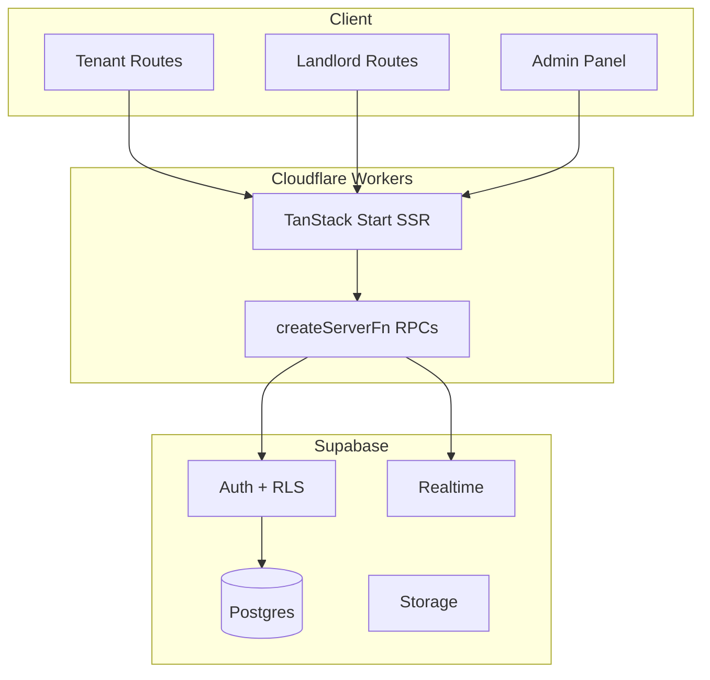

# NyumbaSearch Phase 1 Platform Audit

**Date:** June 2026  
**Deployed:** https://nyumba-search.kevinbuluma1.workers.dev  
**Stack:** TanStack Start + React 19 + Supabase + Cloudflare Workers (Nitro)

---

## Executive Summary

NyumbaSearch has a solid MVP foundation: tenant discovery, map view, landlord dashboard, basic messaging via inquiries, admin panel, trust/verification APIs, booking, payments (M-Pesa stub), AI features, and reviews. Critical gaps remain in **database migration versioning**, **public API security** (service-role reads), **server-side search pagination**, **occupancy-gated reviews**, and **production SEO** (sitemap/structured data).

---

## 1. UI/UX & User Flows

### Implemented Routes

| Route                  | Status   | Notes                                         |
| ---------------------- | -------- | --------------------------------------------- |
| `/`                    | Complete | Landing with hero, CTAs                       |
| `/auth`                | Complete | Email/password sign-in/up                     |
| `/tenant/`             | Partial  | Client-side filters; needs server-side search |
| `/tenant/map`          | Complete | Google Maps + fallback, heatmap, clustering   |
| `/tenant/property/$id` | Complete | Detail, AI chat, booking modal, reviews       |
| `/tenant/saved`        | Complete | Saved properties list                         |
| `/tenant/messages`     | Complete | Inquiry threads                               |
| `/tenant/profile`      | Complete | Verification, viewings, transactions          |
| `/landlord/*`          | Partial  | Dashboard, properties, leads, analytics       |
| `/admin/*`             | Complete | Verification queue, scam reports, audits      |

### Missing / Incomplete Flows

| Flow                   | Problem                                        | Priority |
| ---------------------- | ---------------------------------------------- | -------- |
| Property comparison    | No compare UI                                  | P2       |
| Search alerts          | `saved_searches` table exists, no UI/API wired | P1       |
| Agent dashboard        | No agent role routes                           | P3       |
| WhatsApp integration   | Not implemented                                | P3       |
| Polygon map search     | Map lacks draw-to-search                       | P2       |
| Review after occupancy | Reviews lack tenancy gate                      | P1       |

### UX Issues

- **Trust cues:** Verification badges exist but authenticity/health scores not shown on cards consistently.
- **Empty states:** Generally good on landlord dashboard; tenant search lacks "no results" guidance.
- **Mobile:** Map and tenant home are mobile-first; admin table needs horizontal scroll on small screens.

---

## 2. Database Audit

### Current Tables (from `types.ts`)

`profiles`, `properties`, `property_views`, `saved_properties`, `inquiries`, `inquiry_messages`, `user_roles`, `verifications`, `property_reviews`, `neighborhood_reviews`, `scam_reports`, `viewings`, `saved_searches`, `payments`, `admin_audit_logs`, `property_quality_reports`

### Missing for Full Product Vision

| Table                  | Purpose                                   |
| ---------------------- | ----------------------------------------- |
| `organizations`        | Multi-tenancy / agencies                  |
| `organization_members` | Agency staff                              |
| `property_attributes`  | Structured water/security/parking filters |
| `tenancies`            | Occupancy for review eligibility          |
| `fraud_signals`        | Automated fraud flags                     |
| `image_fingerprints`   | Duplicate image detection                 |
| `push_tokens`          | Mobile push notifications                 |

### Migration Gap

**Critical:** `supabase/migrations/` was empty. Schema exists in production but is not version-controlled in-repo. Migration `001_foundation.sql` added to fix this.

---

## 3. API Architecture

### Implemented Server Functions

| Module              | Endpoints                                              |
| ------------------- | ------------------------------------------------------ |
| `nyumba.functions`  | list/get properties, saved, CRUD, inquiries, dashboard |
| `trust.functions`   | submitVerification, reportScam, checkListingDuplicates |
| `reviews.functions` | property/neighborhood reviews                          |
| `booking.functions` | bookViewing, listMyViewings, updateViewingStatus       |
| `payment.functions` | initiateMpesaPayment, verify, listTransactions         |
| `admin.functions`   | verification/scam moderation, audit logs               |
| `ai.functions`      | recommendations, valuation, chat assistant             |

### Security Issues

| Issue                     | File                  | Fix                              |
| ------------------------- | --------------------- | -------------------------------- |
| Service-role public reads | `nyumba.functions.ts` | Use anon client + RLS            |
| No pagination             | `listProperties`      | Add limit/offset                 |
| No rate limiting          | All public endpoints  | Add rate-limit middleware        |
| Dev logging in prod       | `start.ts`            | **Fixed** — gated to development |

---

## 4. Security Vulnerabilities

1. **Service role on public reads** — bypasses RLS; exposes all columns via `select("*")`.
2. **Filter injection risk** — partially mitigated by character stripping in search terms.
3. **M-Pesa simulation** — `setTimeout` auto-completes payments; replace with Daraja webhook in production.
4. **Admin route guard** — client-side only; server functions correctly use `requireRole("admin")`.

---

## 5. Performance

- Build passes; main bundle ~600KB (needs code splitting).
- Map uses viewport culling for heatmap circles (good).
- React Query offline-first caching configured.
- **Target:** 95+ Lighthouse — needs image optimization, lazy routes, CDN headers.

---

## 6. SEO & Accessibility

| Item                      | Status                                     |
| ------------------------- | ------------------------------------------ |
| Root meta/OG tags         | Complete (`__root.tsx`)                    |
| Per-route titles          | Partial                                    |
| Sitemap                   | **Added** `/sitemap.xml`                   |
| robots.txt                | **Added** `/robots.txt`                    |
| JSON-LD on property pages | **Added**                                  |
| ARIA on map search        | Partial                                    |
| Keyboard nav              | Radix components help; map pins need focus |

---

## 7. Prioritized Backlog

### P0 (Blockers)

- [x] Version-controlled SQL migrations
- [x] Public reads via anon client
- [x] Pagination on property search

### P1 (Trust & Core)

- [x] Authenticity score DB trigger
- [x] Review occupancy gating
- [x] Saved search alerts API

### P2 (Growth)

- [ ] Real M-Pesa Daraja integration
- [ ] Polygon map search UI
- [ ] Agent dashboard

### P3 (Scale)

- [ ] Organizations multi-tenancy
- [ ] Push notification architecture
- [ ] WhatsApp outbound

---

## Architecture Diagram

