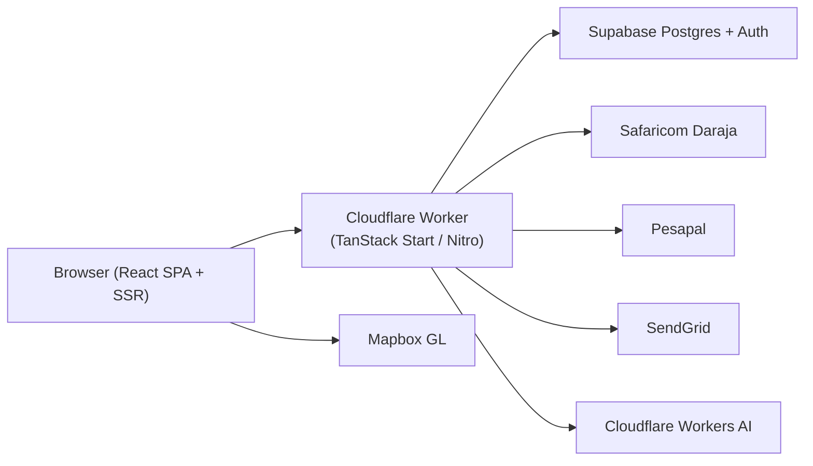

# NyumbaSearch — Architecture

Production: [https://nyumbasearch.com](https://nyumbasearch.com)  
Workers fallback: https://nyumba-search.kevinbuluma9-7ff.workers.dev

## Stack

| Layer     | Technology                                                      |
| --------- | --------------------------------------------------------------- |
| Frontend  | React 19 + TanStack Router + TanStack Start + Vite + TypeScript |
| SSR / API | Cloudflare Workers (Nitro adapter)                              |
| Database  | Supabase Postgres                                               |
| Auth      | Supabase Auth + `user_roles` / portal applications              |
| Email     | SendGrid (`src/lib/api/notify.ts`)                              |
| Payments  | Safaricom Daraja (M-Pesa STK) + Pesapal (cards)                 |
| Maps      | Mapbox GL JS (primary), Google Maps + CSS fallback              |
| AI        | Cloudflare Workers AI + optional Google Gemini                  |
| Hosting   | Cloudflare Workers (static assets + server bundle)              |

> **Note:** Legacy `wrangler.toml` references D1/KV. Production deploy uses generated `dist/server/wrangler.json` with Supabase bindings.

## Request flow



## Key directories

| Path                | Purpose                                            |
| ------------------- | -------------------------------------------------- |
| `src/routes/`       | File-based TanStack Router pages                   |
| `src/lib/api/`      | Server functions (`createServerFn`)                |
| `src/lib/payments/` | M-Pesa, Pesapal, webhooks, renewal cron            |
| `src/lib/revenue/`  | Plans, subscription store, payment fulfillment     |
| `src/components/`   | UI including checkout, maps, landlord shell        |
| `scripts/`          | Deploy sync, migrations, smoke/route audits        |
| `dist/server/`      | Built Worker output (generated on `npm run build`) |

## Payment flow

1. Client calls `initiatePayment` server function → creates `payments` row (`pending`).
2. M-Pesa STK push or Pesapal redirect initiated.
3. Webhook/callback verifies provider signature → updates `payments.status`.
4. `fulfill-payment.ts` applies benefits only when status is `completed`.
5. SendGrid notification sent via `notify.ts` (where wired).

## Auth & portals

- Supabase session in browser; server uses service role for admin operations.
- Roles stored in `user_roles`: `tenant`, `landlord`, `manager`, `agency`, `caretaker`, `admin`.
- Landlord/agency routes gated by parent layout + `LandlordShell`.
- Checkout/boost routes bypass landlord role guard (auth only).

## Cron

Scheduled triggers patched into Worker via `scripts/patch-worker-cron.mjs`:

- Subscription renewals and past-due handling
- Protected by `CRON_SECRET` header

## Deploy pipeline

```bash
npm run build
node scripts/sync-wrangler-env.mjs   # merges .env → wrangler.json + secrets
npx wrangler deploy --config dist/server/wrangler.json
```
