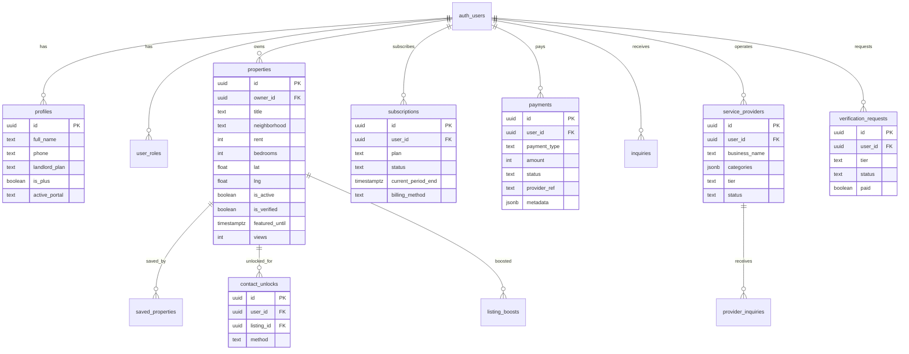

# NyumbaSearch — Database (Supabase Postgres)

Schema is managed via Supabase migrations and apply scripts under `scripts/apply-*-migration.mjs`. Below is the logical model inferred from application code.

## Entity relationship (core)



## Tables referenced in code

| Table                   | Purpose                                                     |
| ----------------------- | ----------------------------------------------------------- |
| `profiles`              | User profile, landlord plan, Plus status, portal preference |
| `user_roles`            | Approved portal roles per user                              |
| `properties`            | Rental listings                                             |
| `saved_properties`      | Tenant saved/favourited listings                            |
| `contact_unlocks`       | Paid/trial/plus contact reveals                             |
| `payments`              | All payment attempts and receipts                           |
| `subscriptions`         | Recurring landlord/tenant/provider subscriptions            |
| `listing_boosts`        | Active property boost packages                              |
| `inquiries` / `leads`   | Landlord lead inbox                                         |
| `verification_requests` | Property verification orders                                |
| `service_providers`     | Home services marketplace                                   |
| `provider_inquiries`    | Tenant → provider messages                                  |
| `organization_members`  | Agency team membership                                      |
| `portal_applications`   | Pending landlord/agency signup requests                     |
| `rental_transactions`   | Revenue ledger entries                                      |

## Migration commands

Use Supabase CLI or project scripts (not D1 `wrangler d1 execute`):

```bash
# Revenue schema
npm run db:migrate:push

# Column patches
npm run db:migrate:columns

# Contact unlock
npm run db:migrate:contact-unlock

# RLS hardening (run in order as needed)
npm run db:migrate:rls
npm run db:migrate:revenue-rls
npm run db:migrate:foundation-rls
```

See [migrations.md](./migrations.md) for the full ordered list.

## RLS

Row-level security is enforced in Supabase. Server-side operations use `SUPABASE_SERVICE_ROLE_KEY` for trusted Worker logic (payments, cron, admin).
